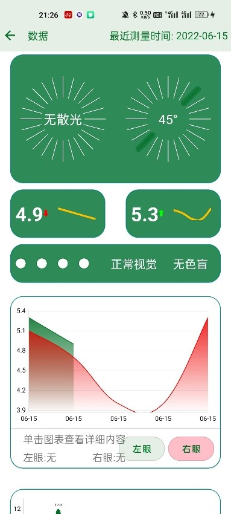

# AI EYE

## 总体介绍

本项目基于Mediapipe开发，开发了两个平台的APP，实现了测视力、测散光、测色盲三个主要功能模块，同时实现了测量距离(需要自定义计算图，我已经重新编译并且可以在Android上进行部署)、手势识别、测试环境亮度、连接电视等功能，并对测试的数据进行记录。本项目具有优秀的动画和交互体验（采用`MotionLayout` `Animation` `TransformationLayout` `Lottie`，比如一镜到底效果）。单击[此处](https://github.com/MikeDean2367/AI-EYE/releases/download/resource/apk.7z)下载安装包。（开发了PC端的，但是没有和此处进行连接，因此不在此处展示）

## 结构说明

该仓库为`AI EYE`的代码。下图为三个APP的通信方式（不同设备之间的、不同进程之间的）

     
    
     

其中`handtiqu`为手势识别APP，它是一个独立的程序，但是无法单独运行，它在手机端的主程序中进行调用。其主要功能是建立与`TV`的连接，并且作为手势识别的平台，将解析的结果通过`Socket`传递到`TV`端。

`Vision`为`AI EYE`的主程序端，它是整个`AI EYE`的核心部分。

`TV`为`AI EYE`的`TV`端，可以在平板上运行（需要注意的是，`TV`需要有摄像头），其主要功能是和手势识别进行通信，用户通过手势和`TV`进行通信，从而在大屏幕上完成手势识别。

使用该程序的基本流程为：

1. 打开主程序`Vision`，注册后可以使用。可以单独在该程序上面完成测量视力、测量散光、测量色盲，并且查看历史数据。
2. 如果要在大屏幕上测试视力，需要在带有摄像头的大屏幕上如电视，安装`TV`端，同时在手机上安装`handtiqu`。安装完成后确保手机端和大屏幕同处于一个WIFI网络中。打开主程序并登录后，在主页点击`TV`，然后点击`连接电视`，扫描屏幕上的二维码。扫描成功后在主页点击`手势识别`，然后程序会切换到`handtiqu`程序，此时便可以按照提示完成测量。

## 代码使用说明

三个文件夹用三个`Android Studio`打开。

该代码编译需要在带有`Bazel`编译环境下进行，具体安装操作可以参考`Google`的`Mediapipe`官网，网址为www.mediapipe.dev。

由于`github`无法上传大于25MB的文件，因此部分文件在[此处](https://github.com/MikeDean2367/AI-EYE/releases/download/resource/resource.zip)。

### Vision

把`release/mp_iris_tracking_aar.aar`移动到`Vision/app/libs`中。

把`res`文件夹移动到`vision/app/src/main`目录下。

### handtiqu

把`release/mp_multi_hand_tracking_aar.aar`移动到`handTiqu/app/libs`中。

### TV

把`release/mp_iris_tracking_aar.aar`移动到`pad/app/libs`中。

## 界面展示

### 主程序手机端

     
    
     

     
    
     

     
    
     

     
    
     

     
    
     

     
    
     

     
    
     

     
    
     

     
    
     

     
    
     

     
    
     

     
    
     

     
    
     

     
    
     

     
    
     

### 手势识别端

     
    
     

### TV端

     
    
     

     
    
     

     
    
     

     
    
     

     
    
     

     
    
     

     
    
     

